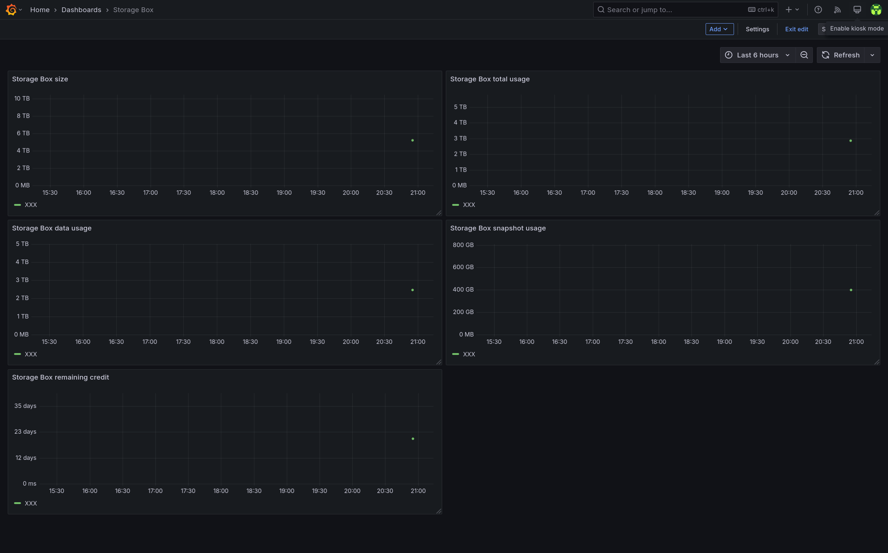

# storagebox-exporter

CLI tool that uploads the Hetzner Storage Box usage data from the Hetzner API to influxdb on a daily basis

## Dependencies

- [go](https://go.dev/)
- [influxdb v2+](https://docs.influxdata.com/influxdb/v2.6/)
- Optional:
  - [make](https://www.gnu.org/software/make/) - for automatic installation support
  - [docker](https://docs.docker.com/)
  - [podman](https://docs.podman.io)
  - [systemd](https://systemd.io/)

## Relevant documentation

- [Hetzner API](https://robot.hetzner.com/doc/webservice/en.html#get-storagebox)
- [InfluxDB API](https://docs.influxdata.com/influxdb/v2.6/write-data/developer-tools/api/)
- [Systemd Timers](https://www.freedesktop.org/software/systemd/man/systemd.timer.html)
- [compose-scheduler](https://github.com/reddec/compose-scheduler)

## Installation

### With Podman Quadlets and systemd timer

1. Configure `storagebox_exporter.json` (see the configuration section below).
1. Copy `storagebox-exporter.container` to `$HOME/.config/containers/systemd/storagebox-exporter.container`
1. Copy `storagebox-exporter.timer` to `$HOME/.config/systemd/user/storagebox-exporter.timer`
1. Reload the user's systemd daemon

  ```bash
    systemctl --user daemon-reload
  ```

1. Run it.

   ```bash
    systemctl --user start storagebox-exporter.timer
   ```

### With Docker

#### docker-compose

1. Configure `storagebox_exporter.json` (see the configuration section below).
1. Run it.

   ```bash
   docker compose up --detach
   ```

#### docker build & run

1. Build the docker image.

   ```bash
   docker build . --tag storagebox-exporter
   ```

1. Configure `storagebox_exporter.json` (see the configuration section below).
1. Run it.

    ```bash
    docker run --rm --init --tty --interactive --read-only --cap-drop ALL --security-opt no-new-privileges:true --cpus 2 -m 64m --pids-limit 16 --volume ./storagebox_exporter.json:/app/storagebox_exporter.json:ro ghcr.io/rare-magma/storagebox-exporter:latest
    ```

### With the Makefile

For convenience, you can install this exporter with the following command or follow the manual process described in the next paragraph.

```bash
make build
make install
$EDITOR $HOME/.config/storagebox_exporter.json
```

### Manually

1. Build `storagebox_exporter` with:

    ```bash
    go build -ldflags="-s -w" -o storagebox_exporter main.go
    ```

2. Copy `storagebox_exporter` to `$HOME/.local/bin/` and make it executable.

3. Copy `storagebox_exporter.json` to `$HOME/.config/`, configure it (see the configuration section below) and make it read only.

4. Copy the systemd unit and timer to `$HOME/.config/systemd/user/`:

    ```bash
    cp storagebox-exporter.* $HOME/.config/systemd/user/
    ```

5. and run the following command to activate the timer:

    ```bash
    systemctl --user enable --now storagebox-exporter.timer
    ```

It's possible to trigger the execution by running manually:

```bash
systemctl --user start storagebox-exporter.service
```

### Config file

The config file has a few options:

```json
{
 "InfluxDBHost": "influxdb.example.com",
 "InfluxDBApiToken": "ZXhhbXBsZXRva2VuZXhhcXdzZGFzZGptcW9kcXdvZGptcXdvZHF3b2RqbXF3ZHFhc2RhCg==",
 "Org": "home",
 "Bucket": "storagebox",
 "WebserviceUsername": "username",
 "WebservicePassword": "password"
}
```

- `InfluxDBHost` should be the FQDN of the influxdb server.
- `Org` should be the name of the influxdb organization that contains the energy consumption data bucket defined below.
- `Bucket` should be the name of the influxdb bucket that will hold the energy consumption data.
- `InfluxDBApiToken` should be the influxdb API token value.
  - This token should have write access to the `BUCKET` defined above.
- `WebserviceUsername` and `WebservicePassword`should be the credentials used to access the storagebox webservice.
  - These can be configured in this [page](https://robot.hetzner.com/preferences/index).

## Troubleshooting

Check the systemd service logs and timer info with:

```bash
journalctl --user --unit storagebox-exporter.service
systemctl --user list-timers
```

## Exported metrics

- size: Total space in MB
- used: Used space in MB
- used_data: Used space by data in MB
- used_snapshot: Used space by snapshots in MB
- paid_until: Paid until date (in unix time)

## Exported metrics example

```
storagebox_stats,id=XXXX,name=box,product=BXXX,cancelled=false,location=FSN1,linked_server=0,samba=false,ssh=true,external_reachability=true,server=username.your-storagebox.de,host=FSN-BXXXXX,webdav=false,zfs=true size=5242880,used=2874308,used_data=2473633,used_snapshot=400675,paid_until=1740700800 1740945301
```

## Example grafana dashboard

In `storagebox-dashboard.json` there is an example of the kind of dashboard that can be built with `storagebox-exporter` data:



Import it by doing the following:

1. Create a dashboard
2. Click the dashboard's settings button on the top right.
3. Go to JSON Model and then paste there the content of the `storagebox-dashboard.json` file.

## Uninstallation

### With the Makefile

For convenience, you can uninstall this exporter with the following command or follow the process described in the next paragraph.

```bash
make uninstall
```

### Manually

Run the following command to deactivate the timer:

```bash
systemctl --user disable --now storagebox-exporter.timer
```

Delete the following files:

```bash
~/.local/bin/storagebox_exporter
~/.config/storagebox_exporter.json
~/.config/systemd/user/storagebox-exporter.timer
~/.config/systemd/user/storagebox-exporter.service
```

## Credits

- [podman quadlets](https://docs.podman.io/en/latest/markdown/podman-systemd.unit.5.html)
- [reddec/compose-scheduler](https://github.com/reddec/compose-scheduler)

This project takes inspiration from the following:

- [fleaz/prometheus-storagebox-exporter](https://github.com/fleaz/prometheus-storagebox-exporter)
